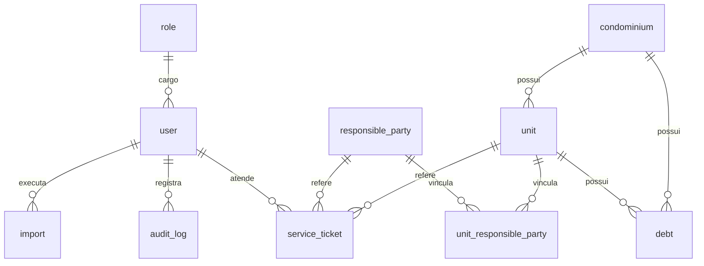

# Estrutura do banco

Modelo lógico do sistema de cobrança condominial. O desenho é genérico: os tipos abaixo valem para o motor que for escolhido. Campo JSON vira `JSONB` no PostgreSQL.

| Tabela | Papel |
| --- | --- |
| [role](#role) | Cargo e permissões |
| [user](#user) | Colaborador do sistema |
| [condominium](#condominium) | Condomínio |
| [unit](#unit) | Unidade do condomínio |
| [responsible_party](#responsible_party) | Pessoa ou empresa responsável |
| [unit_responsible_party](#unit_responsible_party) | Vínculo entre unidade e responsável |
| [debt](#debt) | Débito da unidade |
| [service_ticket](#service_ticket) | Atendimento da unidade |
| [import](#import) | Importação de arquivo |
| [audit_log](#audit_log) | Auditoria de alteração |

## Diagrama

## role

Cargo do colaborador. As permissões ficam em JSON.

| Coluna | Tipo | Nulo | Restrição | Descrição |
| --- | --- | --- | --- | --- |
| id | INT | não | PK, autoincremento | |
| nome | VARCHAR(255) | sim | | Nome do cargo |
| descricao | VARCHAR(255) | sim | | |
| permissao_json | TEXT | sim | | Permissões em JSON |

## user

Colaborador que opera o sistema.

| Coluna | Tipo | Nulo | Restrição | Descrição |
| --- | --- | --- | --- | --- |
| id | INT | não | PK, autoincremento | |
| cargo_id | INT | sim | FK → role.id | Cargo |
| nome | VARCHAR(255) | sim | | |
| telefone | VARCHAR(255) | sim | | |
| email | VARCHAR(255) | sim | | |
| senha | VARCHAR(255) | sim | | Senha |

## condominium

Condomínio atendido.

| Coluna | Tipo | Nulo | Restrição | Descrição |
| --- | --- | --- | --- | --- |
| id | INT | não | PK, autoincremento | |
| nome | VARCHAR(255) | sim | | |
| estado | VARCHAR(255) | sim | | |
| cidade | VARCHAR(255) | sim | | |
| cep | VARCHAR(255) | sim | | |
| logradouro | VARCHAR(255) | sim | | |
| numero | TEXT | sim | | Número do endereço |
| complemento | VARCHAR(255) | sim | | |
| observacao | TEXT | sim | | |

## unit

Unidade de um condomínio: apartamento, casa, sala ou loja.

| Coluna | Tipo | Nulo | Restrição | Descrição |
| --- | --- | --- | --- | --- |
| id | INT | não | PK, autoincremento | |
| condominio_id | INT | não | FK → condominium.id | Condomínio da unidade |
| identificacao | VARCHAR | não | | Identificação. Ex.: 101, A-302 |
| bloco | VARCHAR | sim | | Bloco ou torre |
| tipo | VARCHAR | não | | Apartamento, Casa, Sala, Loja |
| status | VARCHAR | não | padrão `Ativa` | Ativa, Inativa |
| situacao | VARCHAR | não | padrão `Em cobrança` | Em cobrança, Em acordo, Notificada, Ajuizada, Quitada. Quitada quando não há débito vencido |

## responsible_party

Pessoa física ou jurídica ligada às unidades.

| Coluna | Tipo | Nulo | Restrição | Descrição |
| --- | --- | --- | --- | --- |
| id | INT | não | PK, autoincremento | |
| nome | VARCHAR | não | | Nome ou razão social |
| cpf_cnpj | VARCHAR | não | único | CPF ou CNPJ |
| tipo_pessoa | VARCHAR | não | | Fisica, Juridica |
| telefone | VARCHAR | sim | | Telefone principal |
| whatsapp | VARCHAR | sim | | |
| email | VARCHAR | sim | | |
| endereco | TEXT | sim | | Endereço completo em JSON |
| observacoes | TEXT | sim | | |

## unit_responsible_party

Vínculo de muitos para muitos entre unidade e responsável.

| Coluna | Tipo | Nulo | Restrição | Descrição |
| --- | --- | --- | --- | --- |
| id | INT | não | PK, autoincremento | |
| unidade_id | INT | não | FK → unit.id | |
| responsavel_id | INT | não | FK → responsible_party.id | |
| tipo_vinculo | VARCHAR | não | | Proprietario, Inquilino, Administrador, Sindico |
| principal | BOOLEAN | sim | padrão `true` | Responsável principal do vínculo |
| observacoes | TEXT | sim | | |

## debt

Débito ou encargo de uma unidade.

| Coluna | Tipo | Nulo | Restrição | Descrição |
| --- | --- | --- | --- | --- |
| id | INT | não | PK, autoincremento | |
| condominio_id | INT | não | FK → condominium.id | |
| unidade_id | INT | não | FK → unit.id | Unidade de origem |
| referencia | VARCHAR | não | | Referência da cobrança. Ex.: 09/2026 |
| descricao | VARCHAR | sim | | |
| data_vencimento | DATE | não | | |
| valor | DECIMAL(12,2) | sim | | Valor cobrado antes dos acréscimos |
| valor_original | DECIMAL(12,2) | sim | | |
| multa | DECIMAL(12,2) | sim | | |
| juros | DECIMAL(12,2) | sim | | |
| correcao | DECIMAL(12,2) | sim | | |
| valor_atualizado | DECIMAL(12,2) | sim | | |
| status | VARCHAR | não | | Pendente, Pago, Vencido, Cancelado |
| data_pagamento | DATE | sim | | Data do pagamento, quando houver |
| valor_pago | DECIMAL(12,2) | sim | | Valor efetivamente pago |
| origem | VARCHAR | sim | | Superlógica, PDF ou outra administradora |
| identificador_externo | VARCHAR | sim | | ID ou código vindo da administradora |

## service_ticket

Atendimento (palitagem) de uma unidade. Quem registra é o colaborador logado.

| Coluna | Tipo | Nulo | Restrição | Descrição |
| --- | --- | --- | --- | --- |
| id | UUID | não | PK | |
| unidade_id | INT | não | FK → unit.id | |
| responsavel_id | INT | sim | FK → responsible_party.id | |
| usuario_id | INT | não | FK → user.id | Atendente |
| data_hora | TIMESTAMP | não | | |
| canal | VARCHAR | sim | | WhatsApp, Telefone, E-mail |
| assunto | VARCHAR | sim | | |
| descricao | TEXT | sim | | |
| status | VARCHAR | não | | Resolvido, Pendente |
| data_proxima_acao | DATE | sim | | Data prevista para a próxima ação |
| proxima_acao | VARCHAR | sim | | Próxima ação a executar |

## import

Histórico de importação de arquivos: débitos, unidades, responsáveis e outros.

| Coluna | Tipo | Nulo | Restrição | Descrição |
| --- | --- | --- | --- | --- |
| id | INT | não | PK, autoincremento | |
| origem | VARCHAR | sim | | Administradora ou formato. Ex.: Superlógica, PDF |
| tipo | VARCHAR | não | | debitos, responsaveis, unidades |
| arquivo | VARCHAR | sim | | Nome ou caminho do arquivo |
| status | VARCHAR | não | | Processando, Concluida, Erro, Cancelada |
| quantidade_registros | INT | sim | | |
| quantidade_importados | INT | sim | | |
| quantidade_atualizados | INT | sim | | |
| quantidade_erros | INT | sim | | |
| observacao_interna | TEXT | sim | | |
| usuario_id | INT | não | FK → user.id | Quem executou a importação |
| data_importacao | TIMESTAMP | não | | |

## audit_log

Registro de cada alteração feita no sistema.

| Coluna | Tipo | Nulo | Restrição | Descrição |
| --- | --- | --- | --- | --- |
| id | INT | não | PK, autoincremento | |
| usuario_id | INT | sim | FK → user.id | Colaborador que realizou a ação |
| entidade | VARCHAR | não | | Tabela afetada. Ex.: debt, unit |
| registro_id | VARCHAR | sim | | ID do registro afetado |
| acao | VARCHAR | não | | INSERT, UPDATE, DELETE |
| dados_anteriores | TEXT | sim | | Estado antes da alteração, em JSON |
| dados_novos | TEXT | sim | | Estado depois da alteração, em JSON |
| campos_alterados | TEXT | sim | | Campos modificados |
| ip | VARCHAR | sim | | |
| user_agent | VARCHAR | sim | | |
| data_hora | TIMESTAMP | não | | |

## Relacionamentos

| De | Para | Cardinalidade | Coluna |
| --- | --- | --- | --- |
| user | role | muitos para um | cargo_id |
| unit | condominium | muitos para um | condominio_id |
| unit_responsible_party | unit | muitos para um | unidade_id |
| unit_responsible_party | responsible_party | muitos para um | responsavel_id |
| debt | condominium | muitos para um | condominio_id |
| debt | unit | muitos para um | unidade_id |
| service_ticket | unit | muitos para um | unidade_id |
| service_ticket | responsible_party | muitos para um | responsavel_id |
| service_ticket | user | muitos para um | usuario_id |
| import | user | muitos para um | usuario_id |
| audit_log | user | muitos para um | usuario_id |
